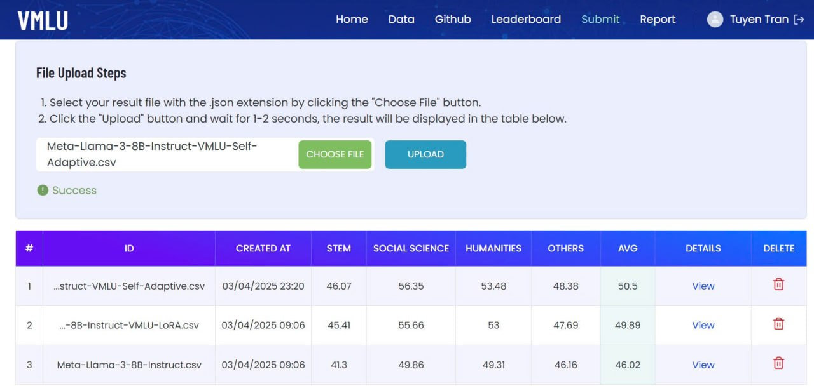

* * *

Self-Adaptive LLM
=================

This repository contains the source code and resources for an experiment implementing the **TRANSFORMER-SQUARED: SELF-ADAPTIVE LLMs** method, applied to the Meta Llama-3-8B model. The fine-tuned model is available on Hugging Face at [JosephTn/transformer\_squared\_llama\_8b](https://huggingface.co/JosephTn/transformer_squared_llama_8b). The experiment was evaluated on the VMLU dataset, with results demonstrating improved performance over baseline models.

<h1 align="center">
   
     

Table of Contents
-----------------

Description
-----------

This project investigates the **TRANSFORMER-SQUARED: SELF-ADAPTIVE LLMs** method, developed by Sakana AI, applied to the Meta Llama-3-8B model. The objective is to enhance the model's capabilities on the VMLU (Visual Mathematical Language Understanding) dataset, which tests language models across diverse categories such as STEM, Social Science, Humanities, and Others.

The fine-tuned model, named transformer\_squared\_llama\_8b, is hosted on Hugging Face and can be accessed [here](https://huggingface.co/JosephTn/transformer_squared_llama_8b). All source code for the experiment is available in this repository: [https://github.com/tuyentn/self-adaptive-llm](https://github.com/tuyentn/self-adaptive-llm).

Methodology
-----------

The TRANSFORMER-SQUARED method introduces a self-adaptive mechanism to large language models, enabling dynamic adjustments during training or inference to optimize performance. In this experiment, we adapted this approach to the Meta Llama-3-8B model and fine-tuned it on the VMLU dataset.

_Note_: For a detailed explanation of the TRANSFORMER-SQUARED method, refer to the original work by Sakana AI. Specific fine-tuning details (e.g., epochs, learning rate) are implemented in the source code and can be reviewed in the repository scripts.

Results
-------

The self-adaptive model's performance was evaluated on the VMLU dataset and compared against the base Meta Llama-3-8B model and a LoRA-adapted version. The results are summarized below:

**Model**

**STEM**

**Social Science**

**Humanities**

**Others**

**Average**

<h1 align="center">
   
     

The self-adaptive model achieved the highest average score of **50.5**, with significant improvements in Social Science (56.35) and Humanities (53.48) categories.

Installation
------------

To run the code in this repository, ensure you have Python 3.8 or higher installed. Using a virtual environment is recommended.

1.  Clone the repository:
    
    bash
    
    CollapseWrapCopy
    
    `git clone https://github.com/tuyentn/self-adaptive-llm.git cd self-adaptive-llm`
    
2.  Install the required dependencies:
    
    bash
    
    CollapseWrapCopy
    
    `pip install -r requirements.txt`
    

_Note_: If a requirements.txt file is not present, install key dependencies such as transformers, torch, and any others specified in the source code manually.

Usage
-----

You can load and use the fine-tuned model directly from Hugging Face:

python

CollapseWrapCopy

`from transformers import AutoModelForCausalLM, AutoTokenizer model_name = "JosephTn/transformer_squared_llama_8b" model = AutoModelForCausalLM.from_pretrained(model_name) tokenizer = AutoTokenizer.from_pretrained(model_name)`

To evaluate the model on the VMLU dataset using the provided scripts, run:

bash

CollapseWrapCopy

`python evaluate.py --model_path JosephTn/transformer_squared_llama_8b --dataset vmlu`

_Note_: Adjust the command based on the actual script and arguments defined in the repository.

Examples
--------

*   **Inference**: Check examples/inference.py (if available) for a demonstration of text generation using the fine-tuned model.
*   **Evaluation**: The evaluate.py script (if present) shows how to assess the model on the VMLU dataset.

_Note_: Update this section with specific file names or examples once the repository structure is finalized.

Contributing
------------

Contributions are welcome! If you encounter issues or have suggestions, please:

1.  Open an issue on the [GitHub repository](https://github.com/tuyentn/self-adaptive-llm).
2.  Submit a pull request with your changes.

Please follow these guidelines:

*   Match the existing code style.
*   Provide clear and concise commit messages.
*   Test your changes locally before submitting.

License
-------

This project is licensed under the \[LICENSE NAME\] License - see the file for details.

_Note_: Replace \[LICENSE NAME\] with the actual license (e.g., MIT, Apache 2.0) used in your repository.

Contact
-------

For questions or collaboration opportunities, reach out via:

*   **GitHub**: [tuyentn](https://github.com/tuyentn)
*   **Email**: \[[tuyentn0101@gmail.com](mailto:tuyentn0101@gmail.com)\] (

* * *
